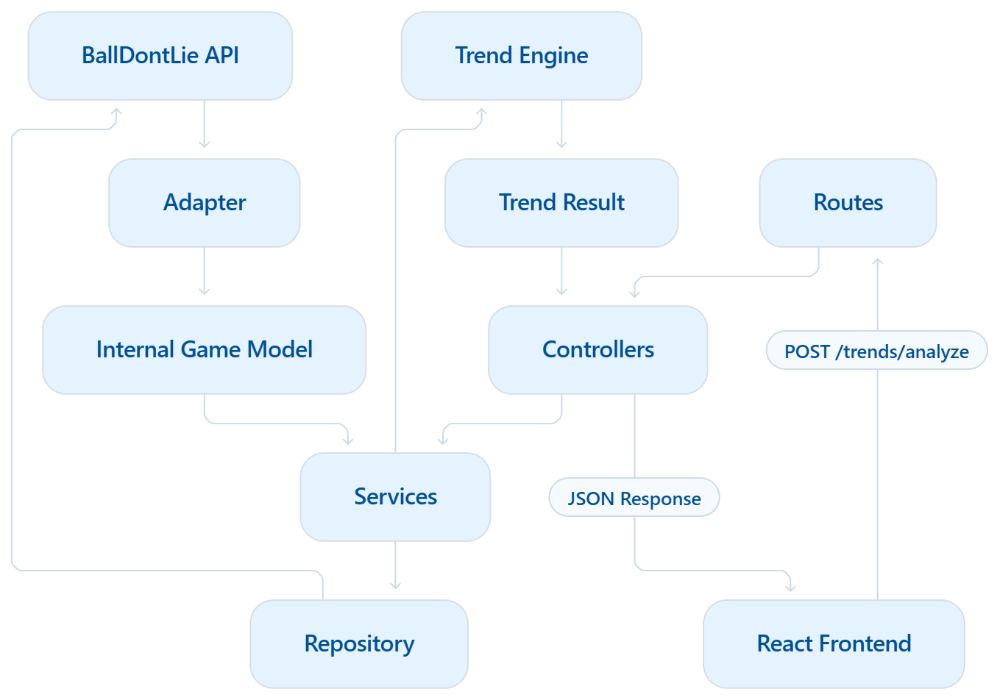
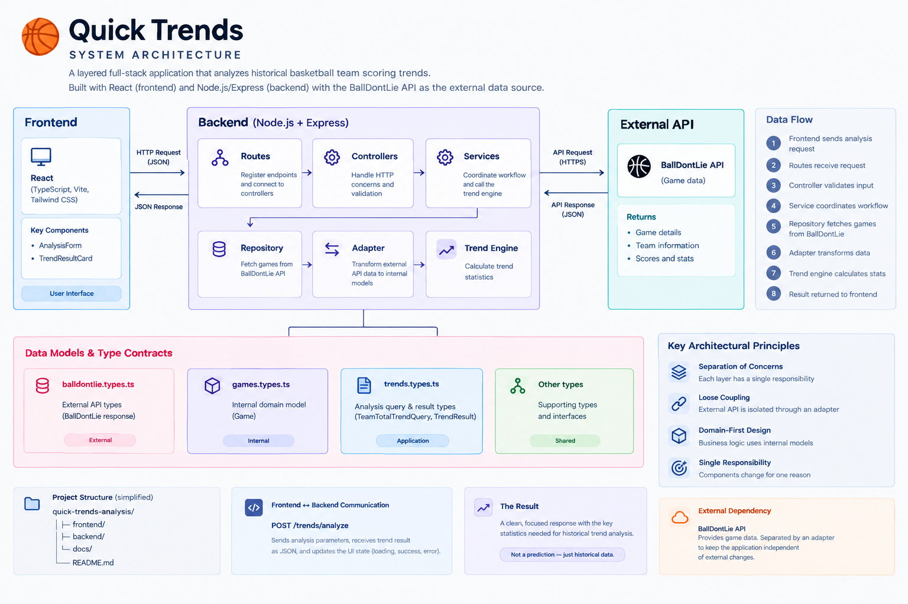

# Quick Trends

Quick Trends is a full-stack basketball statistics application that analyzes historical team scoring data and turns it into simple, readable trend statistics.
The goal is to make historical basketball research faster by retrieving game data automatically instead of requiring users to manually go through individual games and calculate the statistics themselves.

> **Current Status:** V1 complete

---

## What Quick Trends Does

A user provides:

- Team ID
- Season
- Number of recent games to analyze
- Target scoring line
  Quick Trends retrieves the team's historical games, determines the team's score in each game, and calculates:
- Hit percentage
- Number of hits
- Number of misses
- Average team score
- Total games analyzed
  For example, a user can analyze whether a team scored above a particular scoring line across its recent games.
  Quick Trends reports historical statistics and does not make predictions.

---

## V1 Features

- Historical team scoring analysis
- Configurable target scoring line
- Configurable sample size
- Season selection
- Hit percentage calculation
- Average score calculation
- Hit/miss breakdown
- Loading state
- Error handling
- Responsive User interface
- External API integration
- Layered backend architecture
- Internal domain models separated from external API models

---

## Tech Stack

### Frontend

- React
- TypeScript
- Vite
- Tailwind CSS
- Fetch API

### Backend

- Node.js
- Express
- TypeScript
- REST API
- Custom middleware
- Custom error handling

### External Data

- BallDontLie API

---

## Architecture

Quick Trends uses a layered backend architecture that separates HTTP handling, application workflow, data access, external API integration, data transformation, and business logic.
High-level request flow:

```text
Frontend
    ↓
Backend API
    ↓
Routes
    ↓
Controllers
    ↓
Services
    ↓
Repository
    ↓
BallDontLie API
    ↓
Adapter
    ↓
Internal Domain Models
    ↓
Trend Engine
    ↓
Trend Result
    ↓
Controller
    ↓
Frontend
```

Quick Trends uses a layered full-stack architecture.


For a detailed explanation of the architecture, see
[System Architecture](docs/system-architecture.md)
---

## API

### POST `/trends/analyze`

Analyzes a team's historical scoring trend using the supplied team, season, sample size, and scoring line.
Example request:

```json
{
  "teamId": 14,
  "season": 2025,
  "limit": 10,
  "line": 120
}
```

Example response:

```json
{
  "hits": 5,
  "averageScore": 117.6,
  "hitPercentage": 100,
  "misses": 0,
  "totalGames": 5
}
```

For complete endpoint documentation, request fields, responses, and error behavior, see:
[API Documentation](docs/api.md)
---

## Getting Started

### Prerequisites

Make sure you have:

- Node.js
- npm
- The BallDontLie API configuration required by the backend

### Clone the repository

```bash
git clone [https://github.com/OlugbemiSamuel/quick-trends-analysis.git](https://github.com/OlugbemiSamuel/quick-trends-analysis.git)
cd quick-trends-analysis
```

### Install frontend dependencies

```bash
cd frontend
npm install
```

### Install backend dependencies

Open another terminal or return to the project root:

```bash
cd backend
npm install
```

### Environment Configuration

Configure the BallDontLie API credentials required by the backend.
Do not commit private API credentials to GitHub.

### Start the backend

```bash
cd backend
npm run dev
```

### Start the frontend

In another terminal:

```bash
cd frontend
npm run dev
```

The frontend and backend run independently during development.
---

## Frontend Flow

The frontend uses a state-driven analysis flow:

```text
Form
  ↓
Loading
  ↓
Result
```

If the request fails:

```text
Form
  ↓
Loading
  ↓
Error
  ↓
Try Again
```

The result screen replaces the form after a successful analysis instead of displaying both at the same time.
This keeps the interface focused on the user's current task.
---

## Project Goals

Quick Trends was built as a practical full-stack project to strengthen my understanding of:

- React and TypeScript
- Node.js and Express
- REST API design
- Layered backend architecture
- External API integration
- Data transformation
- Separation of concerns
- Error handling
- Frontend/backend communication
- Responsive UI development
  The project focuses on understanding the complete flow of data rather than simply building a UI around an API.

---

## V1 Scope

V1 intentionally focuses on historical team scoring analysis.
The following are outside the scope of V1:

- User authentication
- Persistent analysis history
- Predictions
- Notifications
- Community features
- AI-generated recommendations
- Player prop analysis
  These may be considered for future versions where they provide a clear product or engineering benefit.

---

## Future Improvements

Potential future improvements include:

- Additional statistical analysis types
- Player analysis
- Persistent analysis history
- Improved team selection
- Automated testing
- Production deployment
- More detailed game-level breakdowns
  Future features will be evaluated based on the product's needs rather than added simply to increase the feature count.

---

## Project Status

### V1 — Complete

The first version currently supports:

- Frontend analysis form
- Backend REST API
- External basketball data integration
- Internal domain models
- Trend calculation engine
- Error handling
- Loading and result states
- Responsive interface
